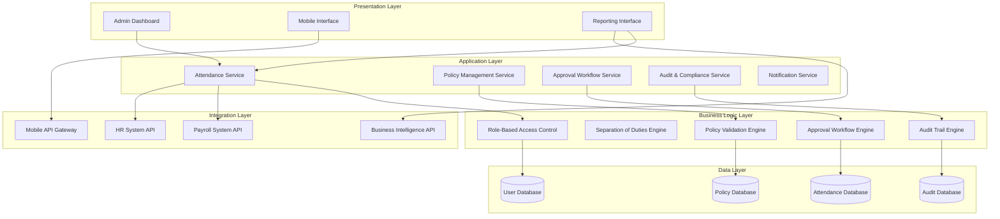
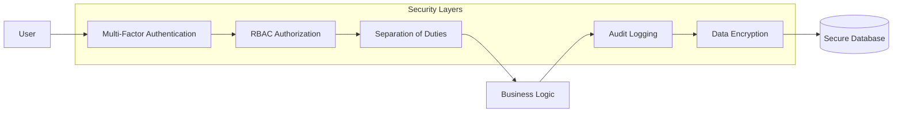

# Admin Attendance System Design

## Overview

The Admin Attendance System is a comprehensive enterprise-grade module within PRIMA that manages the dual nature of Admin users as both system operators and regular employees. The system enforces strict separation of duties, maintains comprehensive audit trails, and provides robust attendance management capabilities while ensuring compliance with organizational policies and regulatory requirements.

## Architecture

### High-Level Architecture



### Security Architecture



## Components and Interfaces

### Core Components

#### 1. Attendance Management Component
- **Personal Attendance Controller**: Handles Admin's own check-in/check-out operations
- **Employee Attendance Controller**: Manages attendance operations for all employees
- **Attendance Data Repository**: Stores and retrieves attendance records
- **Validation Engine**: Enforces attendance policies and business rules

#### 2. Policy Management Component
- **Policy Configuration Controller**: Manages work hours, shifts, and grace periods
- **Holiday Management Controller**: Handles holiday calendars and special dates
- **Remote Work Policy Controller**: Manages location-based attendance rules
- **Policy Validation Service**: Validates policy configurations and changes

#### 3. Approval Workflow Component
- **Request Processing Engine**: Handles regularization and missed punch requests
- **Approval Routing Service**: Routes requests to appropriate approvers
- **SLA Monitoring Service**: Tracks approval timeframes and sends alerts
- **Escalation Management Service**: Handles escalations to Super Admin

#### 4. Audit and Compliance Component
- **Audit Trail Service**: Maintains immutable logs of all actions
- **Compliance Monitoring Service**: Tracks policy adherence and violations
- **Report Generation Service**: Creates audit and compliance reports
- **Data Integrity Service**: Ensures data immutability and consistency

#### 5. Security and Access Control Component
- **RBAC Service**: Enforces role-based permissions
- **Separation of Duties Service**: Prevents self-approval scenarios
- **Session Management Service**: Handles authentication and session security
- **Access Logging Service**: Logs all system access attempts

### Interface Specifications

#### REST API Endpoints

```typescript
// Personal Attendance APIs
POST /api/admin/attendance/checkin
POST /api/admin/attendance/checkout
GET /api/admin/attendance/history
POST /api/admin/attendance/regularization-request

// Employee Management APIs
GET /api/admin/employees/attendance
POST /api/admin/employees/attendance/correction
GET /api/admin/employees/requests/pending
PUT /api/admin/employees/requests/{id}/approve
PUT /api/admin/employees/requests/{id}/reject

// Policy Management APIs
GET /api/admin/policies/attendance
PUT /api/admin/policies/work-hours
PUT /api/admin/policies/grace-periods
POST /api/admin/policies/holidays

// Reporting APIs
GET /api/admin/reports/daily
GET /api/admin/reports/monthly
GET /api/admin/reports/exceptions
POST /api/admin/reports/export

// Audit APIs
GET /api/admin/audit/trails
GET /api/admin/audit/compliance
GET /api/admin/audit/access-logs
```

## Data Models

### Core Data Entities

#### Attendance Record
```typescript
interface AttendanceRecord {
  id: string;
  employeeId: string;
  date: Date;
  checkInTime?: Date;
  checkOutTime?: Date;
  location: GeoLocation;
  deviceInfo: DeviceInfo;
  status: AttendanceStatus;
  workHours: number;
  overtime: number;
  isLocked: boolean;
  createdBy: string;
  createdAt: Date;
  lastModifiedBy?: string;
  lastModifiedAt?: Date;
}

enum AttendanceStatus {
  PRESENT = 'PRESENT',
  ABSENT = 'ABSENT',
  PARTIAL = 'PARTIAL',
  LATE = 'LATE',
  EARLY_DEPARTURE = 'EARLY_DEPARTURE',
  REGULARIZED = 'REGULARIZED'
}
```

#### Regularization Request
```typescript
interface RegularizationRequest {
  id: string;
  employeeId: string;
  requestDate: Date;
  attendanceDate: Date;
  requestType: RegularizationType;
  reason: string;
  proposedCheckIn?: Date;
  proposedCheckOut?: Date;
  status: RequestStatus;
  submittedAt: Date;
  approvedBy?: string;
  approvedAt?: Date;
  rejectionReason?: string;
  auditTrail: AuditEntry[];
}

enum RegularizationType {
  MISSED_PUNCH = 'MISSED_PUNCH',
  TIME_CORRECTION = 'TIME_CORRECTION',
  ATTENDANCE_REGULARIZATION = 'ATTENDANCE_REGULARIZATION'
}

enum RequestStatus {
  PENDING = 'PENDING',
  APPROVED = 'APPROVED',
  REJECTED = 'REJECTED',
  ESCALATED = 'ESCALATED'
}
```

#### Policy Configuration
```typescript
interface AttendancePolicy {
  id: string;
  organizationId: string;
  policyName: string;
  workingHours: WorkingHours;
  gracePeriod: GracePeriod;
  overtimeRules: OvertimeRules;
  remoteWorkRules: RemoteWorkRules;
  holidayCalendar: Holiday[];
  effectiveFrom: Date;
  effectiveTo?: Date;
  createdBy: string;
  approvedBy?: string;
  status: PolicyStatus;
}

interface WorkingHours {
  standardHours: number;
  flexibleHours: boolean;
  coreHours?: TimeRange;
  shifts: Shift[];
}

interface GracePeriod {
  checkInGrace: number; // minutes
  checkOutGrace: number; // minutes
  lunchBreakGrace: number; // minutes
}
```

#### Audit Trail
```typescript
interface AuditEntry {
  id: string;
  entityType: string;
  entityId: string;
  action: AuditAction;
  performedBy: string;
  performedAt: Date;
  ipAddress: string;
  userAgent: string;
  oldValues?: Record<string, any>;
  newValues?: Record<string, any>;
  reason?: string;
  sessionId: string;
  isImmutable: boolean;
}

enum AuditAction {
  CREATE = 'CREATE',
  UPDATE = 'UPDATE',
  DELETE = 'DELETE',
  APPROVE = 'APPROVE',
  REJECT = 'REJECT',
  LOCK = 'LOCK',
  UNLOCK = 'UNLOCK',
  EXPORT = 'EXPORT',
  ACCESS = 'ACCESS'
}
```

## Correctness Properties

*A property is a characteristic or behavior that should hold true across all valid executions of a system-essentially, a formal statement about what the system should do. Properties serve as the bridge between human-readable specifications and machine-verifiable correctness guarantees.*

### Personal Attendance Properties

**Property 1: Admin Attendance Functionality Parity**
*For any* Admin user, the check-in and check-out functionality should be identical to regular employee functionality in terms of available features and validation rules
**Validates: Requirements 1.1, 1.2**

**Property 2: Admin Attendance Data Consistency**
*For any* Admin attendance record, the data structure and validation rules should be identical to employee attendance records
**Validates: Requirements 1.2, 1.3**

**Property 3: Admin Self-Approval Prevention**
*For any* Admin regularization request, the system should prevent self-approval and require external authorization
**Validates: Requirements 1.4, 1.5**

### Employee Management Properties

**Property 4: Comprehensive Employee Access**
*For any* Admin user, access to employee attendance data should include all employees with appropriate filtering and search capabilities
**Validates: Requirements 2.1**

**Property 5: Mandatory Reason Logging**
*For any* manual attendance correction by an Admin, the system should require a mandatory reason and log the action with complete metadata
**Validates: Requirements 2.2**

**Property 6: Request Processing Workflow**
*For any* attendance request processed by an Admin, the system should update status, validate against policies, and maintain audit trails
**Validates: Requirements 2.3, 2.4**

**Property 7: Attendance Data Immutability**
*For any* locked attendance period, the data should be immutable and prevent modifications except through audit-approved processes
**Validates: Requirements 2.5**

### Policy Management Properties

**Property 8: Policy Configuration Validation**
*For any* attendance policy configuration, the system should validate against business rules and apply changes to correct employee groups
**Validates: Requirements 3.1, 3.2, 3.3**

**Property 9: Location-Based Validation**
*For any* remote or hybrid work configuration, the system should enforce location-based validation consistently
**Validates: Requirements 3.4**

**Property 10: Policy Change Approval Workflow**
*For any* policy change requiring Super Admin approval, the system should route through appropriate workflows and maintain audit trails
**Validates: Requirements 3.5**

### Approval Workflow Properties

**Property 11: Pending Request Display**
*For any* Admin viewing pending requests, the system should display all requests with priority indicators and SLA status
**Validates: Requirements 4.1**

**Property 12: Business Rule Enforcement**
*For any* approval processing, the system should enforce business rules and validate against policies before allowing approval
**Validates: Requirements 4.2**

**Property 13: Escalation Context Preservation**
*For any* executive-level case escalation, the system should provide complete context and history to Super Admin
**Validates: Requirements 4.3**

**Property 14: SLA Monitoring and Alerting**
*For any* pending approval exceeding SLA timeframes, the system should send automated alerts and escalation notifications
**Validates: Requirements 4.4**

### Reporting and Analytics Properties

**Property 15: Real-Time Report Data**
*For any* attendance report generation, the system should provide current data with exceptions and policy violations highlighted
**Validates: Requirements 5.1, 5.5**

**Property 16: Accurate Metric Calculations**
*For any* attendance summary calculation, the system should provide accurate metrics, overtime, and compliance statistics
**Validates: Requirements 5.2**

**Property 17: Export Data Integrity**
*For any* attendance data export, the system should maintain data integrity and format according to target system requirements
**Validates: Requirements 5.3**

**Property 18: Anomaly Detection and Alerting**
*For any* attendance pattern analysis, the system should detect anomalies and provide configurable alerts
**Validates: Requirements 5.4**

### Audit and Compliance Properties

**Property 19: Complete Audit Trail**
*For any* attendance-related action, the system should log complete audit information with timestamps, user identifiers, and reasons
**Validates: Requirements 6.1, 6.2**

**Property 20: Audit Log Immutability**
*For any* audit log entry, the system should prevent deletion or modification while maintaining complete accessibility
**Validates: Requirements 6.2, 6.3**

**Property 21: Compliance Gap Identification**
*For any* compliance report generation, the system should identify policy adherence and highlight compliance gaps
**Validates: Requirements 6.4**

**Property 22: Access Attempt Logging**
*For any* system access attempt, the system should log with success/failure status, IP addresses, and user information
**Validates: Requirements 6.5**

### Security and Access Control Properties

**Property 23: RBAC Permission Enforcement**
*For any* Admin system access, the system should enforce role-based permissions and validate Admin privileges
**Validates: Requirements 7.1**

**Property 24: Separation of Duties Enforcement**
*For any* action requiring separation of duties, the system should prevent self-approval and require secondary authorization
**Validates: Requirements 7.2**

**Property 25: Payroll Data Access Restriction**
*For any* attempt to access payroll salary data, the system should restrict access unless explicitly granted separate permissions
**Validates: Requirements 7.3**

**Property 26: Session Security Management**
*For any* Admin session, the system should handle expiration properly and require re-authentication for continued access
**Validates: Requirements 7.5**

### Integration and Performance Properties

**Property 27: Data Synchronization Consistency**
*For any* attendance data management, the system should maintain synchronization with employee master data and organizational hierarchy
**Validates: Requirements 8.1**

**Property 28: API Security and Compatibility**
*For any* data export operation, the system should provide secure APIs and compatible data formats
**Validates: Requirements 8.2**

**Property 29: Referential Integrity Maintenance**
*For any* attendance correction, the system should maintain referential integrity across all integrated modules
**Validates: Requirements 8.4**

**Property 30: Performance Under Load**
*For any* bulk operation or high-load scenario, the system should maintain acceptable performance and prevent data corruption
**Validates: Requirements 10.1, 10.2, 10.4**

## Error Handling

### Error Categories and Handling Strategies

#### 1. Validation Errors
- **Input Validation Failures**: Return structured error responses with field-specific messages
- **Policy Violation Errors**: Provide clear policy violation descriptions and remediation steps
- **Business Rule Violations**: Return actionable error messages with context

#### 2. Authorization Errors
- **Insufficient Permissions**: Return 403 Forbidden with specific permission requirements
- **Separation of Duties Violations**: Log attempt and return clear violation message
- **Session Expiration**: Redirect to authentication with session context preservation

#### 3. Data Integrity Errors
- **Concurrent Modification**: Implement optimistic locking with conflict resolution
- **Referential Integrity Violations**: Provide clear dependency information
- **Audit Trail Corruption**: Trigger immediate security alerts and system lockdown

#### 4. Integration Errors
- **External System Failures**: Implement circuit breaker pattern with fallback mechanisms
- **API Rate Limiting**: Implement exponential backoff and request queuing
- **Data Synchronization Failures**: Maintain transaction logs for recovery

#### 5. Performance Errors
- **Timeout Handling**: Implement graceful degradation with partial results
- **Resource Exhaustion**: Implement load shedding and priority queuing
- **Database Connection Issues**: Implement connection pooling and failover

### Error Recovery Mechanisms

#### Automatic Recovery
- **Transient Failures**: Automatic retry with exponential backoff
- **Network Issues**: Connection pooling and automatic reconnection
- **Temporary Resource Constraints**: Request queuing and delayed processing

#### Manual Recovery
- **Data Corruption**: Manual data restoration from audit trails
- **Policy Conflicts**: Admin intervention for policy resolution
- **Security Breaches**: Manual security review and system restoration

## Testing Strategy

### Dual Testing Approach

The testing strategy employs both unit testing and property-based testing to ensure comprehensive coverage and correctness validation.

#### Unit Testing
- **Specific Scenarios**: Test concrete examples of attendance operations, policy configurations, and approval workflows
- **Edge Cases**: Test boundary conditions, error scenarios, and exceptional cases
- **Integration Points**: Test interfaces between components and external systems
- **Security Scenarios**: Test authentication, authorization, and audit logging

#### Property-Based Testing
- **Universal Properties**: Verify that correctness properties hold across all valid inputs using QuickCheck for TypeScript
- **Test Configuration**: Each property-based test runs a minimum of 100 iterations with randomized inputs
- **Property Tagging**: Each test includes explicit references to design document properties using the format: **Feature: admin-attendance-system, Property {number}: {property_text}**
- **Coverage Areas**: 
  - Admin functionality parity with employees
  - Separation of duties enforcement
  - Audit trail completeness and immutability
  - Policy validation and enforcement
  - Data integrity and consistency
  - Security and access control
  - Performance under load

#### Testing Framework Selection
- **Unit Tests**: Jest with TypeScript support for component and service testing
- **Property-Based Tests**: fast-check library for TypeScript property-based testing
- **Integration Tests**: Supertest for API endpoint testing
- **End-to-End Tests**: Playwright for full user workflow testing

#### Test Data Management
- **Test Data Generation**: Automated generation of realistic attendance data, policy configurations, and user scenarios
- **Data Isolation**: Each test runs with isolated data to prevent interference
- **Cleanup Procedures**: Automatic cleanup of test data and system state after each test run

The comprehensive testing approach ensures that both specific use cases and general system properties are validated, providing confidence in the system's correctness and reliability under various conditions.